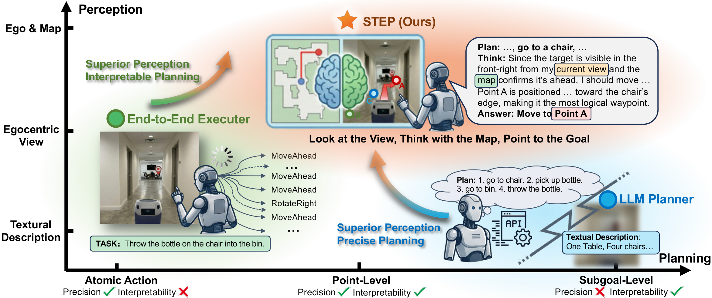
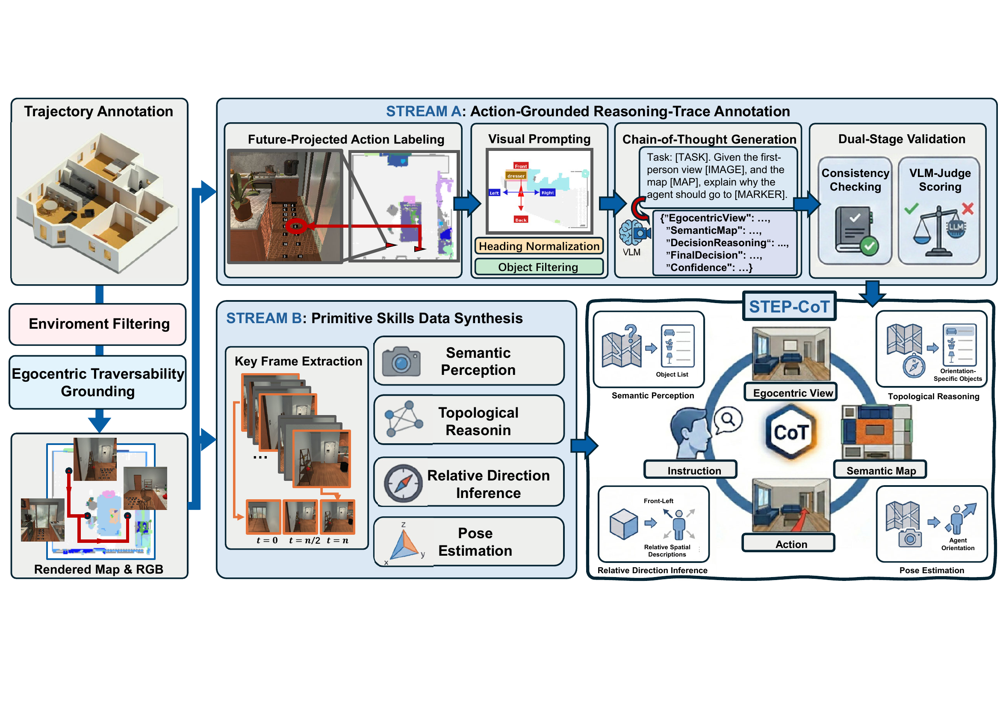

<div align="center">

# STEP: Spatial Thinking and Egocentric Pointing<br/>for Embodied Instruction Following

<p><b><a href="https://eccv.ecva.net/Conferences/2026/AcceptedPapers">ECCV 2026</a> · Official implementation</b></p>

<p>
  <a href="#training"></a>
  <a href="#evaluation"></a>
  <a href="#data"></a>
  <a href="#citation"></a>
  <a href="LICENSE"></a>
</p>

<p><b>Look at the View · Think with the Map · Point to the Goal</b></p>



</div>

---

## 📖 Overview

Embodied Instruction Following requires an agent to understand its surroundings and turn
language into reliable actions. Existing LLM-based agents are limited by **Spatial Myopia**,
which obscures global scene structure, and **Granularity Imbalance**, which leaves a gap
between abstract subgoals and low-level actions. **STEP** addresses both problems through
Hybrid Map-Egocentric Perception and Point-Level Planning: it jointly reasons over the
egocentric RGB view and a Bird's-Eye-View (BEV) map, then produces interpretable reasoning
traces that terminate in precise visual waypoints.

STEP is trained with **STEP-CoT**, a scalable data engine that aligns instructions,
observations, semantic maps, actions, and reasoning chains. Experiments on ALFRED and
AI2-THOR-Nav, together with real-world deployments, demonstrate strong planning performance
and cross-environment generalization.

### ✨ Key ideas

- **Hybrid Perception.** A Map Encoder + Visual Encoder + Text Encoder tri-encoder
  architecture fuses BEV maps with egocentric views, giving the agent global spatial
  awareness beyond its immediate sight.
- **Point-Level Planning.** Grounded-SAM + Set-of-Mark annotate reachable regions in
  the current view. STEP then generates a Chain-of-Thought that terminates in a
  concrete waypoint, uniting rigorous precision with semantic interpretability.
- **STEP-CoT Data Engine.** A scalable pipeline that distills expert ALFRED trajectories
  into 400k+ multimodal CoT samples, augmented with primitive-skill data (topological
  reasoning, pose estimation, relative orientation, semantic inquiry, …) to boost
  spatial awareness.

## 📁 Repository layout

```
STEP/
├── LICENSE
├── README.md
├── TRAINING.md
├── assets/           # figures used in this README
├── LLaMA-Factory/    # vendored training backbone
├── scripts/          # STEP training YAML recipe(s)
├── data/             # portable registry, format spec, and 3 concrete records
└── evaluation/       # notes on reproducing ALFRED / AI2-THOR-Nav numbers
```

<a id="training"></a>

## 🚀 Training

STEP is fine-tuned from **Qwen2.5-VL-7B-Instruct**. The training code is built on top
of [LLaMA-Factory](https://github.com/hiyouga/LLaMA-Factory) — a pruned copy is
vendored at [`LLaMA-Factory/`](LLaMA-Factory/) so the training stack does not depend on
an unpinned external checkout.

Quick start:

```bash
# 1. Install
cd LLaMA-Factory
pip install -e ".[torch,metrics,deepspeed]"

# 2. Put the full corpus at ../data/step_cot_train.json, or update
#    ../data/dataset_info.json to point to your local filename.

# 3. Launch full SFT with the STEP recipe
llamafactory-cli train ../scripts/qwen2_5vl_full_sft_STEP.yaml
```

Full details, hyper-parameter rationale, and distributed-launch patterns are in
[`TRAINING.md`](TRAINING.md).

<a id="data"></a>

## 🗂️ Data

STEP-CoT is constructed from expert embodied trajectories using two complementary streams.
**Stream A** reconstructs semantic contextual maps, projects future expert poses into the
current egocentric view to obtain point-level targets, applies heading normalization and
object filtering, and uses a teacher MLLM to generate reasoning traces. Consistency checking
and VLM-Judge scoring retain high-quality annotations. **Stream B** extracts trajectory
keyframes to synthesize primitive-skill tasks covering semantic perception, topological
reasoning, relative direction inference, and pose estimation; task-breakdown examples are
added to strengthen instruction decomposition.

<p align="center">
  
</p>

<p align="center"><em>STEP-CoT combines action-grounded reasoning-trace annotation with primitive-skills data synthesis.</em></p>

- **Schema:** [`data/DATA_FORMAT.md`](data/DATA_FORMAT.md) documents the ShareGPT-style
  JSON layout, prompt conventions, and the three task families (point-level navigation,
  task breakdown, primitive skills).
- **Registry:** [`data/dataset_info.json`](data/dataset_info.json) contains portable
  entries for both the samples and the forthcoming full corpus.
- **Samples:** [`data/`](data/) contains **three concrete records** (topological
  reasoning, pose estimation, point-level navigation) together with their RGB / BEV
  images, so you can inspect the exact format the model consumes.
- **Full STEP-CoT corpus:** the complete dataset will be released on
  [Hugging Face](https://huggingface.co/) after final organization and verification are
  complete; the download link will be added here.

<a id="evaluation"></a>

## 📊 Evaluation

STEP is evaluated on **ALFRED** and **AI2-THOR-Nav**. We do not fork the evaluators —
instead, we run against the community-standard implementations:

- **ALFRED** — <https://github.com/askforalfred/alfred>
- **AI2-THOR** — <https://github.com/allenai/ai2thor>

STEP predicts a point-level waypoint in the current view. The final local control is then
handed to the **Fast Marching Method (FMM)**, which converts the selected waypoint into an
executable action sequence over the local occupancy map.

<a id="citation"></a>

## 📚 Citation

If you find STEP useful for your research, please cite:

```bibtex
@inproceedings{li2026step,
  title     = {STEP: Spatial Thinking and Egocentric Pointing
               for Embodied Instruction Following},
  author    = {Li, Hanxuan and Fu, Bin and Lin, Zeyuan and
               Wang, Ruiping and Chen, Xilin},
  booktitle = {European Conference on Computer Vision (ECCV)},
  year      = {2026}
}
```

## 📄 License

The STEP-specific code and configs in this repository are released under the
[Apache-2.0 license](LICENSE). The vendored LLaMA-Factory copy retains its original
Apache-2.0 license — see [`LLaMA-Factory/LICENSE`](LLaMA-Factory/LICENSE).
